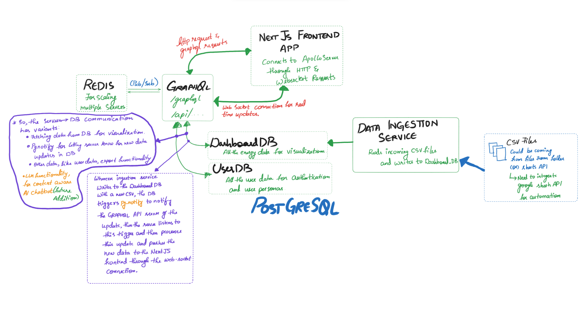

# System Architecture

The system is designed as a set of decoupled microservices managed within a single monorepo. This allows for independent development, deployment, and scaling of each component.

### Visual Diagram

A visual representation of the entire system, illustrating the flow of data for both initial requests and real-time updates.

